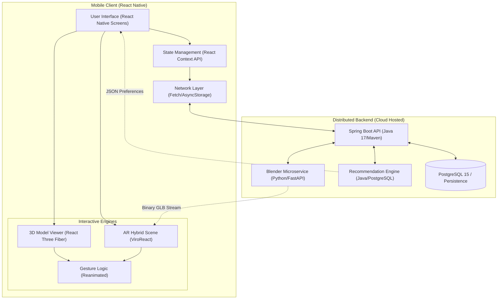

# 🌐 Backend Architecture & Features Overview

The backend acts as the central data orchestrator for the mobile AR application. It seamlessly connects user account configurations driven by the mobile app down to the dynamic 3D asset generation handled by a separate python microservice.

---

## 🏗️ System Architecture Overview

---

### 1. Spring Boot Core Service
*   **Data Management & Authentication:** Handles user accounts, secures the API endpoints using robust session controls, and fetches real-time catalog data.
*   **Customization Persistence:** Saves the user's selected configuration for cars inside the virtual Studio. Attributes stored include exact hex mappings for the following 7 material slots:
    *   `CAR_BODY_PRIMARY` (Main Body)
    *   `CAR_BODY_SECONDARY` (Accent Finish)
    *   `CAR_INTERIOR_1` (Dashboard & Console)
    *   `CAR_INTERIOR_2` (Seat Upholstery)
    *   `CAR_INTERIOR_3` (Interior Trims)
    *   `CAR_RIM` (Wheel Rims)
    *   `CARBON_MATERIAL_1` (Carbon Fiber)

### 2. Blender 3D Model Customization Service (Microservice)
*   **Dynamic Generation:** A specialized Python/Flask service that takes hex color parameters directly from the Spring Server.
*   **Material Application:** Automatically extracts these hex codes and maps them to physical materials on the base 3D vehicle `.blend` or `.obj` files using Blender's Python API (`bpy`).
*   **AR-Ready Export:** Asynchronously renders the customized materials and exports a finalized `.glb` 3D streaming footprint payload perfectly optimized for the mobile ViroReact AR engine.

### 3. Recommendation Engine
*   **Intelligent Suggestions:** Analyzes user query behavior, interactions inside the AR Studio, and spatial session duration.
*   **Discovery Engine:** Recommends targeted, personalized cars that match the behavioral signature of the logged-in user in real-time.

---

## 🎨 How Customization & AR Works
1.  **Selection:** The user explores the digital showroom on their mobile app and selects a base car model.
2.  **Customization Workspace:** The user chooses their preferred hex color codes across the 7 available 3D material slots (`CAR_BODY_PRIMARY`, `CAR_BODY_SECONDARY`, `CAR_INTERIOR_1`, `CAR_INTERIOR_2`, `CAR_INTERIOR_3`, `CAR_RIM`, `CARBON_MATERIAL_1`).
3.  **Storage:** The React Native frontend sends these color parameters to the **Spring Boot Server**, which saves them in the database against the user's profile/session.
4.  **Generation:** When the user decides to view the car in their real environment, the Spring Boot server triggers the **Blender Service**. The service fetches the saved colors and dynamically applies these materials to the 3D `.glb`/`.gltf` model.
5.  **AR Placement:** The customized model is served back to the mobile app, where the user can project the life-scale, personalized car onto their physical surroundings (e.g., their driveway) using their smartphone camera.
