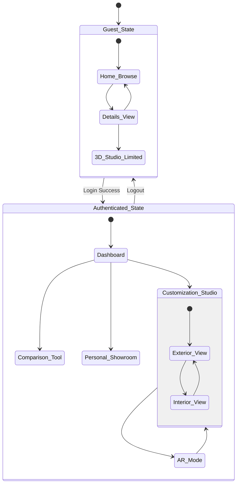

# 🚗 AR Car Showcase - Backend Services

An immersive **Augmented Reality Car Showcase** mobile app powered by a robust backend infrastructure. This repository houses the cloud-hosted backend APIs and microservices.

---

## 🔗 Related Repository

This repository specifically contains the **Spring Boot Server** and **Blender Microservice**.
If you are looking for the mobile app UI built with React Native and Viro AR, see the frontend repository below:

*   📱 **[AR-Car-Showcase Frontend Repository](https://github.com/AdepuSriCharan/AR-Car-Showcase.git)**

---

## 🛠️ Backend Tech Stack

| Technology | Role |
| :--- | :--- |
| **Java 17 / Spring Boot** | Core REST APIs, Authentication, State Management |
| **PostgreSQL 15** | Relational Database (Users, Catalog, Customization Persistence) |
| **Python / Flask** | Blender Microservice for remote 3D Generation |
| **Blender (Headless)** | Automated `bpy` (Cycles/Eevee) Texture Mapping |

---

## 🌐 Backend Architecture Overview

The backend acts as the central data orchestrator for the mobile AR application. It seamlessly connects user account configurations driven by the mobile app down to the dynamic 3D asset generation handled by a separate python microservice.

### 1. Spring Boot Core Service
*   **Data Management & Authentication:** Handles user accounts, secures the API endpoints using robust session controls, and fetches real-time catalog data.
*   **Customization Persistence:** Saves the user's selected configuration for cars inside the virtual Studio. Attributes stored include:
    *   **Primary** (exterior body)
    *   **Secondary** (accents/trim)
    *   **Interior 1** (primary upholstery)
    *   **Interior 2** (secondary details/dashboard)

### 2. Blender 3D Model Customization Service (Microservice)
*   **Dynamic Generation:** A specialized Python/Flask service that takes hex color parameters directly from the Spring Server.
*   **Material Application:** Automatically extracts these hex codes and maps them to physical materials on the base 3D vehicle `.blend` or `.obj` files using Blender's Python API (`bpy`).
*   **AR-Ready Export:** Asynchronously renders the customized materials and exports a finalized `.glb` 3D streaming footprint payload perfectly optimized for the mobile ViroReact AR engine.

### 3. Recommendation Engine
*   **Intelligent Suggestions:** Analyzes user query behavior, interactions inside the AR Studio, and spatial session duration.
*   **Discovery Engine:** Recommends targeted, personalized cars that match the behavioral signature of the logged-in user in real-time.

## 📚 Documentation Hub

To keep this repository clean and easy to navigate, detailed information has been organized into dedicated documentation files. 
Please refer to the following links for full setup instructions, backend architecture details, and all graphical UML diagrams.

### 1. Project Setup
*   **[Setup & Installation Guide](docs/SETUP.md):** Step-by-step instructions on setting up PostgreSQL, running the Spring Boot server, and initializing the Python Blender microservice.

### 2. Architecture & Features
*   **[Backend Architecture Overview](docs/ARCHITECTURE.md):** Deep dive into how the Spring Core server, the `.glb` Blender generator, and the ML Recommendation Engine interact to serve the mobile app.

### 3. UML Diagram Gallery
Detailed UML diagrams (using Mermaid.js syntax) map out the entire structural, behavioral, and interaction logic.
*   **[Categorized UML Reference View](src/main/resources/Project_UML_Docs/Categorized_UML_Reference.md):** Single-page view of all diagrams.
*   **[Structural Architecture](src/main/resources/Project_UML_Docs/Structural/):** System, Component, and Class logic diagrams.
*   **[Behavioral Flows](src/main/resources/Project_UML_Docs/Behavioral/):** App state machines, Use Cases, and User Journeys.
*   **[Interaction Flows](src/main/resources/Project_UML_Docs/Interactions/):** Sequence diagrams for Auth, 3D AR Customization, and ML Recommendations.

---

## 📱 Frontend Client Application

The backend serves an immersive **Augmented Reality Car Showcase** mobile app built with **React Native**, **Expo**, and **ViroReact**.

### Mobile App Overview
- 🔭 **Augmented Reality:** View 3D car models in the real environment using ViroReact (ARCore/ARKit)
- 🎨 **Color Customization:** Customize car body, rims, interior, carbon fiber, etc., per material slot
- 🚘 **3D Model Viewer:** Explore detailed models with React Three Fiber (pinch-to-zoom, swipe-to-rotate)
- 🧠 **AI Recommendations:** Fetches personalized car suggestions from the Spring Boot backend
- 🗂️ **File-Based Routing:** Powered by Expo Router for seamless navigation

### Frontend Architecture

The mobile app relies on a **layered, context-driven architecture**:

```
┌─────────────────────────────────────────────────┐
│                   Expo Router                   │
│         (File-based Navigation + Layouts)       │
├─────────────────────────────────────────────────┤
│               React Context Layer               │
│  AuthContext │ CarContext │ ThemeContext      │
├─────────────────────────────────────────────────┤
│              Screen / Page Layer                │
│  app/(main)/  │  app/auth/  │  app/scenes/    │
├─────────────────────────────────────────────────┤
│             Component Layer                     │
│  CarCard │ CustomizerScreen │ AnimatedTabBar  │
├─────────────────────────────────────────────────┤
│             Custom Hooks Layer                  │
│  useModelSource │ useSceneMaterials           │
├─────────────────────────────────────────────────┤
│           3D / AR Rendering Layer               │
│  R3F Canvas (Studio) │ ViroReact (AR Scene)   │
└─────────────────────────────────────────────────┘
```

### Full System Architecture (Frontend to Backend)


### State Machine Diagram (Client Navigation)


