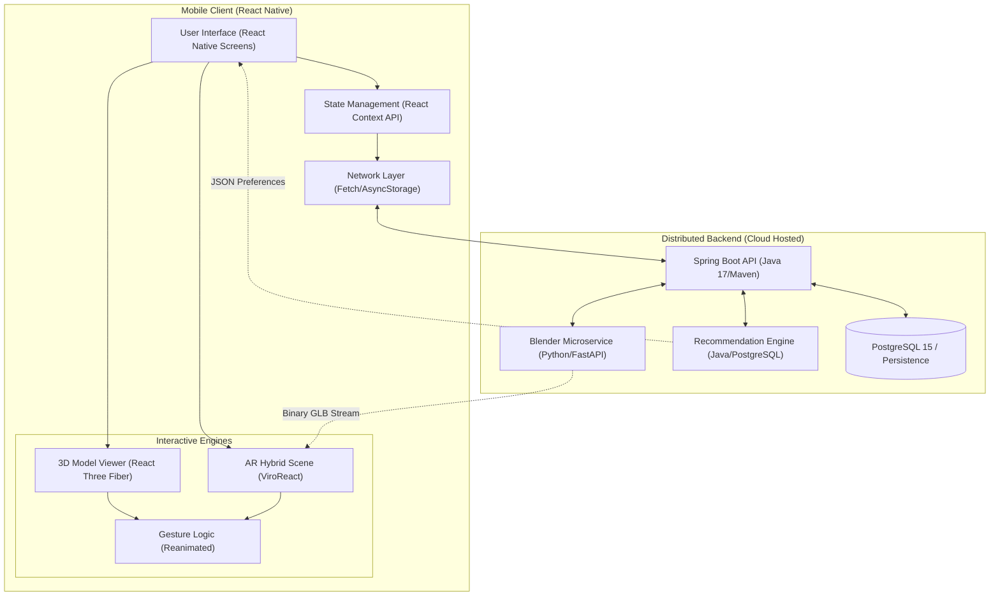

# 🚗 AR Car Showcase - Backend Services

An immersive **Augmented Reality Car Showcase** mobile app powered by a robust backend infrastructure. This repository houses the cloud-hosted backend APIs and microservices.

---

## � Project Overview

The **Augmented Reality (AR) Car Showcase** is a mobile-based digital showroom that allows users to visualize, customize, and evaluate vehicles within their real environment. 

The system integrates a mobile interface developed using React Native, a **Spring Boot backend service** for data management and authentication, a **Blender-based 3D model generation pipeline** for configurable vehicle models, and a **Machine-Learning recommendation module** for personalized vehicle suggestions. The application enables real-time interaction with 3D models, modification of vehicle appearance parameters, and placement of life-scale vehicles within physical surroundings through augmented reality.

---

## �️ Backend Tech Stack

| Technology | Role |
| :--- | :--- |
| **Java 17 / Spring Boot** | Core REST APIs, Authentication, State Management |
| **PostgreSQL 15** | Relational Database (Users, Catalog, Customization Persistence) |
| **Python / Flask** | Blender Microservice for remote 3D Generation |
| **Blender (Headless)** | Automated `bpy` (Cycles/Eevee) Texture Mapping |

---

## 🌐 Core System Architecture

The following diagram illustrates the high-level architecture of the AR Car Showcase application, showing the interaction between the mobile frontend, the AR engine, and the backend services.

---

## 📚 Documentation Hub

To keep this repository clean and easy to navigate, detailed information has been organized into dedicated documentation files. 
Please refer to the following links for full setup instructions, deeper architecture details, and all graphical UML diagrams.

### 1. Project Setup
*   **[Setup & Installation Guide](docs/SETUP.md):** Step-by-step instructions on setting up PostgreSQL, running the Spring Boot server, and initializing the Python Blender microservice.

### 2. Architecture & Features Details
*   **[Backend Architecture Overview](docs/ARCHITECTURE.md):** Deep dive into how the Spring Core server, the `.glb` Blender generator, and the ML Recommendation Engine interact to serve the mobile app.

### 3. Detailed UML Diagram Gallery
*   **[UML Documentation Hub](docs/UML.md):** A detailed gallery containing links to all Structural, Behavioral, and Interaction UML diagrams (such as Auth flows, 3D logic, and Recommendations).

---

## 🔗 Related Repository

This repository specifically contains the **Spring Boot Server** and **Blender Microservice**.
If you are looking for the mobile app UI built with React Native and Viro AR, see the frontend repository below:

*   📱 **[AR-Car-Showcase Frontend Repository](https://github.com/AdepuSriCharan/AR-Car-Showcase.git)**
