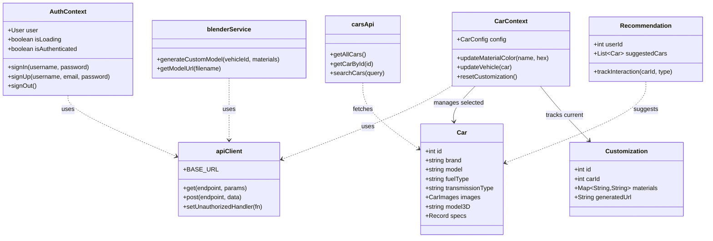
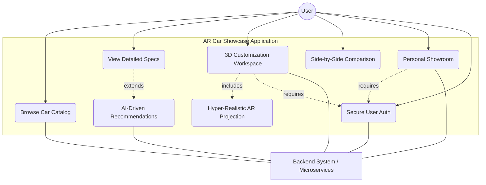
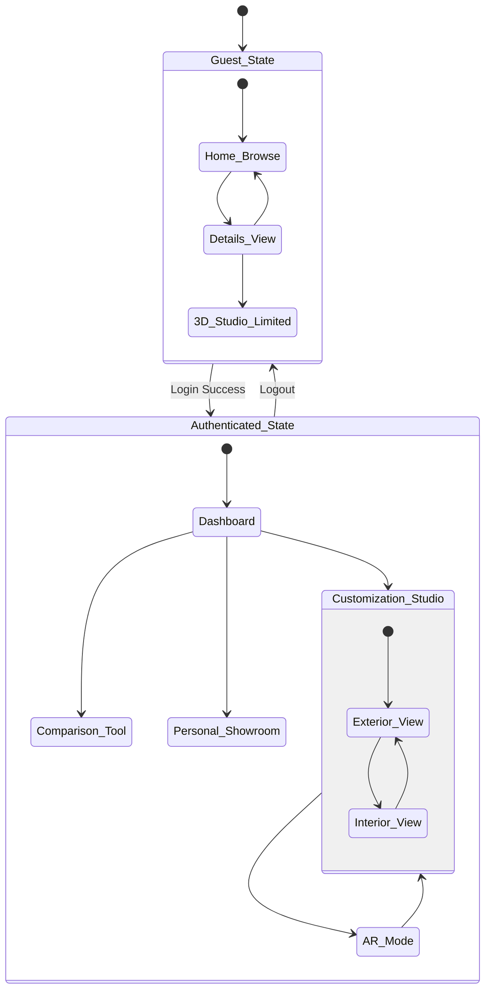
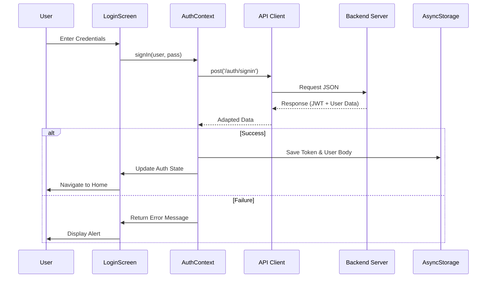
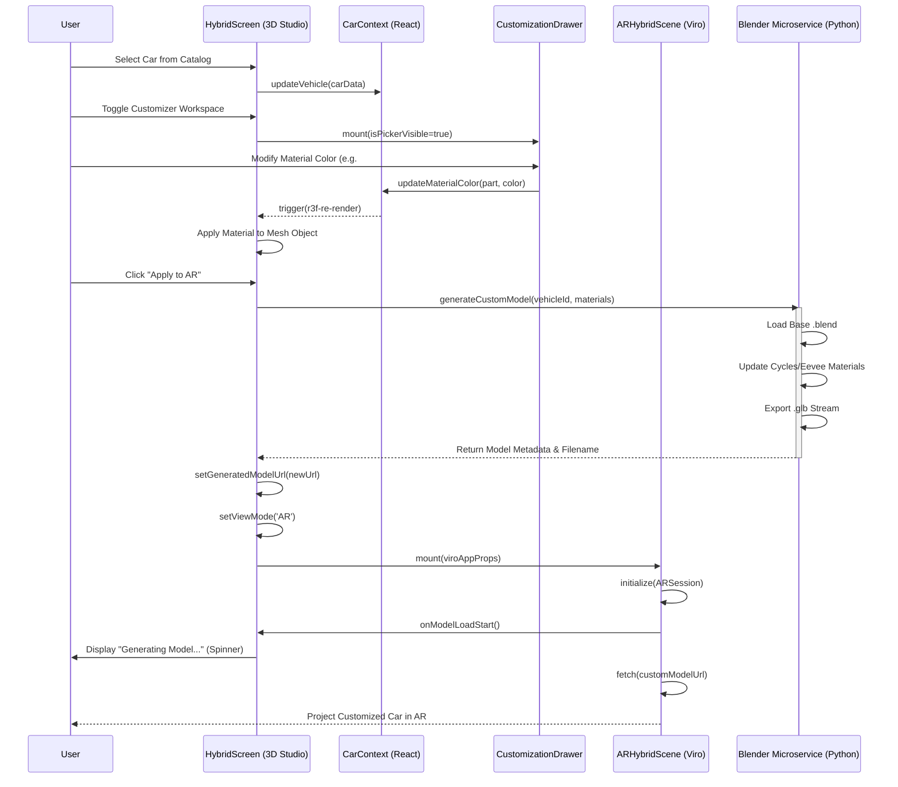
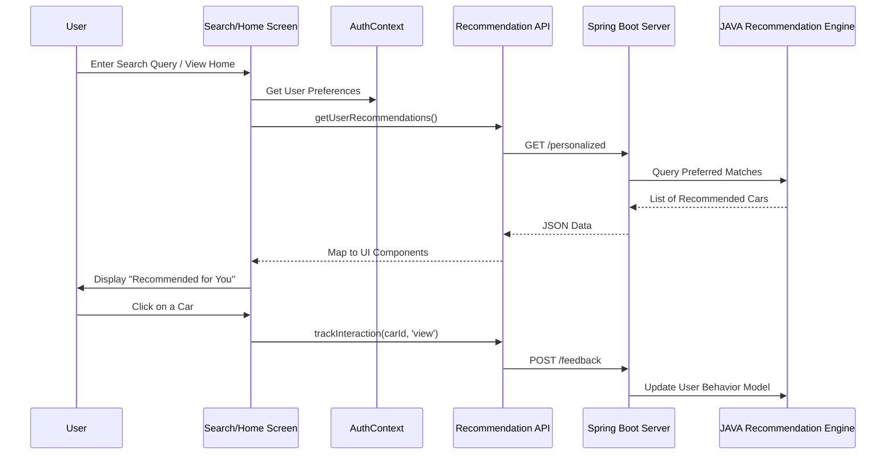

# 🚗 AR Car Showcase - Backend Services

An immersive **Augmented Reality Car Showcase** mobile app powered by a robust backend infrastructure. This repository houses the cloud-hosted backend APIs and microservices.

---

## 🔗 Related Repository

This repository specifically contains the **Spring Boot Server** and **Blender Microservice**.
If you are looking for the mobile app UI built with React Native and Viro AR, see the frontend repository below:

*   📱 **[AR-Car-Showcase Frontend Repository](https://github.com/AdepuSriCharan/AR-Car-Showcase.git)**

---

## 🛠️ Backend Tech Stack

| Technology | Role |
| :--- | :--- |
| **Java 17 / Spring Boot** | Core REST APIs, Authentication, State Management |
| **PostgreSQL 15** | Relational Database (Users, Catalog, Customization Persistence) |
| **Python / Flask** | Blender Microservice for remote 3D Generation |
| **Blender (Headless)** | Automated `bpy` (Cycles/Eevee) Texture Mapping |

---

## 🌐 Backend Architecture Overview

The backend acts as the central data orchestrator for the mobile AR application. It seamlessly connects user account configurations driven by the mobile app down to the dynamic 3D asset generation handled by a separate python microservice.

### 1. Spring Boot Core Service
*   **Data Management & Authentication:** Handles user accounts, secures the API endpoints using robust session controls, and fetches real-time catalog data.
*   **Customization Persistence:** Saves the user's selected configuration for cars inside the virtual Studio. Attributes stored include:
    *   **Primary** (exterior body)
    *   **Secondary** (accents/trim)
    *   **Interior 1** (primary upholstery)
    *   **Interior 2** (secondary details/dashboard)

### 2. Blender 3D Model Customization Service (Microservice)
*   **Dynamic Generation:** A specialized Python/Flask service that takes hex color parameters directly from the Spring Server.
*   **Material Application:** Automatically extracts these hex codes and maps them to physical materials on the base 3D vehicle `.blend` or `.obj` files using Blender's Python API (`bpy`).
*   **AR-Ready Export:** Asynchronously renders the customized materials and exports a finalized `.glb` 3D streaming footprint payload perfectly optimized for the mobile ViroReact AR engine.

### 3. Recommendation Engine
*   **Intelligent Suggestions:** Analyzes user query behavior, interactions inside the AR Studio, and spatial session duration.
*   **Discovery Engine:** Recommends targeted, personalized cars that match the behavioral signature of the logged-in user in real-time.

## Features & Services

### 1. Spring Boot Core Service
*   **Data Management & Authentication:** Handles user accounts, sessions, and secures the API endpoints.
*   **Customization Persistence:** Saves the user's selected configuration for the cars. When a user customizes a vehicle, they can choose specific colors for:
    *   **Primary** (exterior body)
    *   **Secondary** (accents/trim)
    *   **Interior 1** (primary upholstery)
    *   **Interior 2** (secondary details/dashboard)
*   These parameters are stored securely in the database and retrieved when generating the vehicle model for AR viewing.

### 2. Blender 3D Model Customization Service
*   **Dynamic Generation:** A specialized service that takes the color parameters (Primary, Secondary, Interior 1, Interior 2) saved in the backend.
*   **Material Application:** Extracts these colors and applies them programmatically to the base 3D vehicle model using Blender's Python API.
*   **AR-Ready Export:** Generates the finalized, customized 3D model footprint optimized for mobile AR rendering so the user can project the exact configured car into their environment.

### 3. ML Recommendation Engine
*   **Intelligent Suggestions:** Analyzes user interaction behavior, customization preferences (such as favored colors and models), and AR placement frequency.
*   **Personalized Discovery:** Utilizes Machine Learning to proactively recommend relevant vehicles that align with the user's tastes, shifting away from conventional, static catalog browsing.

### 🏗️ Structural Architecture

#### 1. System Architecture


#### 2. Component Structure
```mermaid
componentDiagram
    [App Flow / Router] <<Main>> as App

    package "Navigation Layer" {
        [Drawer Layout] as Drawer
        [Tabs Layout] as Tabs
    }

    package "State Management" {
        [AuthContext] as AuthCtx
        [CarContext] as CarCtx
        [ThemeContext] as ThemeCtx
    }

    package "Feature Components" {
        [3D Studio / Hybrid] as Studio
        [AR Scenes] as AR
        [Car Catalog] as Catalog
        [Comparison View] as Compare
        [Personalization] as Prefs
    }

    package "Service Layer" {
        [API Client] as Client
        [Blender Service] as Blender
        [Recommendation Service] as Rec
    }

    App --> Drawer
    Drawer --> Tabs

    Tabs --> Catalog
    Tabs --> Prefs

    Catalog --> Studio
    Studio --> AR

    Studio --> CarCtx
    AR --> CarCtx

    AuthCtx --> Client
    CarCtx --> Client

    Client --> Blender
    Client --> Rec
```

#### 3. Core Logic & Contexts (Class Diagram)


---

### 🚦 Behavioral Flows

#### 1. Application Use Cases


#### 2. App State Machine


#### 3. User Journey (Activity)
```mermaid
activityDiagram
    start
    :User Launches App;
    if (Is Logged In?) then (No)
        :Browse Generic Catalog;
        :View Car Details;
        if (User wants to customize?) then (Yes)
            :Prompt Login;
            stop
        else (No)
            stop
        endif
    else (Yes)
        :View Personalized Recommendations;
        :Search/Select Specific Car;
        :Open 3D Studio;
        repeat
            :Pick Material (Paint, Wheels, etc.);
            :Apply Color/Texture;
            :Manipulate Model (Rotate/Zoom);
        until (User Satisfied?)
        fork
            :Save to My Showroom;
        fork
            :Launch AR Experience;
            :Find Horizontal Surface;
            :Place Car in Real World;
            :Take Screenshot/View;
        end fork
    endif
    stop
```

---

### 🔄 Interaction & Sequence Flows

#### 1. Authentication Flow


#### 2. 3D Customization & AR Projection Flow


#### 3. Recommendation & Intelligent Search Flow


## How Customization & AR Works
1.  **Selection:** The user explores the digital showroom on their mobile app and selects a base car model.
2.  **Customization:** The user chooses their preferred hex color codes for **Primary**, **Secondary**, **Interior 1**, and **Interior 2**.
3.  **Storage:** The React Native frontend sends these color parameters to the **Spring Boot Server**, which saves them in the database against the user's profile/session.
4.  **Generation:** When the user decides to view the car in their real environment, the Spring Boot server triggers the **Blender Service**. The service fetches the saved colors and dynamically applies these materials to the 3D `.glb`/`.gltf` model.
5.  **AR Placement:** The customized model is served back to the mobile app, where the user can project the life-scale, personalized car onto their physical surroundings (e.g., their driveway) using their smartphone camera.

---

## 📱 Frontend Client Application

The backend serves an immersive **Augmented Reality Car Showcase** mobile app built with **React Native**, **Expo**, and **ViroReact**.

### Mobile App Overview
- 🔭 **Augmented Reality:** View 3D car models in the real environment using ViroReact (ARCore/ARKit)
- 🎨 **Color Customization:** Customize car body, rims, interior, carbon fiber, etc., per material slot
- 🚘 **3D Model Viewer:** Explore detailed models with React Three Fiber (pinch-to-zoom, swipe-to-rotate)
- 🧠 **AI Recommendations:** Fetches personalized car suggestions from the Spring Boot backend
- 🗂️ **File-Based Routing:** Powered by Expo Router for seamless navigation

### Frontend Architecture

The mobile app relies on a **layered, context-driven architecture**:

```
┌─────────────────────────────────────────────────┐
│                   Expo Router                   │
│         (File-based Navigation + Layouts)       │
├─────────────────────────────────────────────────┤
│               React Context Layer               │
│  AuthContext │ CarContext │ ThemeContext      │
├─────────────────────────────────────────────────┤
│              Screen / Page Layer                │
│  app/(main)/  │  app/auth/  │  app/scenes/    │
├─────────────────────────────────────────────────┤
│             Component Layer                     │
│  CarCard │ CustomizerScreen │ AnimatedTabBar  │
├─────────────────────────────────────────────────┤
│             Custom Hooks Layer                  │
│  useModelSource │ useSceneMaterials           │
├─────────────────────────────────────────────────┤
│           3D / AR Rendering Layer               │
│  R3F Canvas (Studio) │ ViroReact (AR Scene)   │
└─────────────────────────────────────────────────┘
```

### Full System Architecture (Frontend to Backend)


### State Machine Diagram (Client Navigation)


