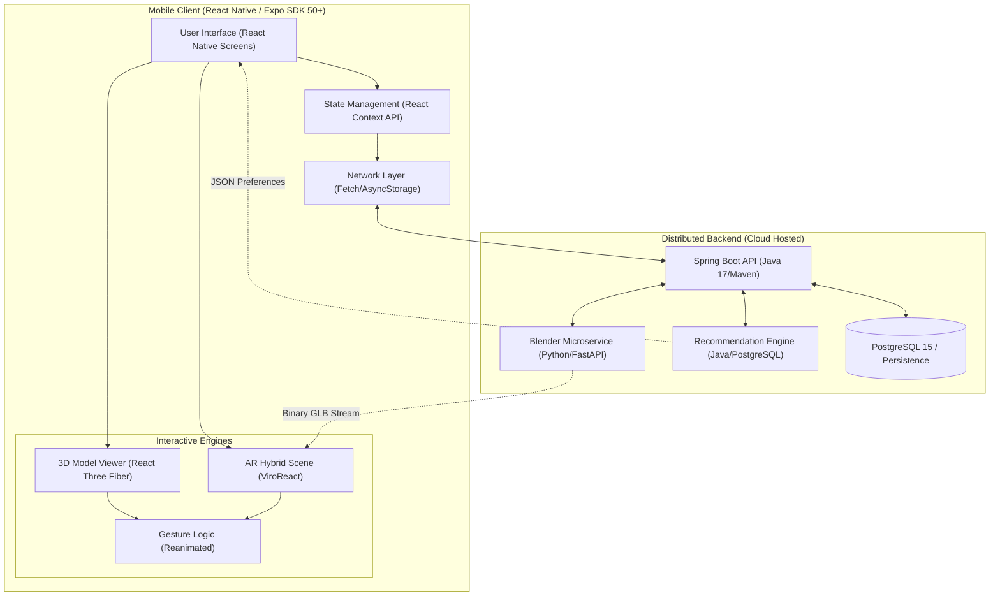
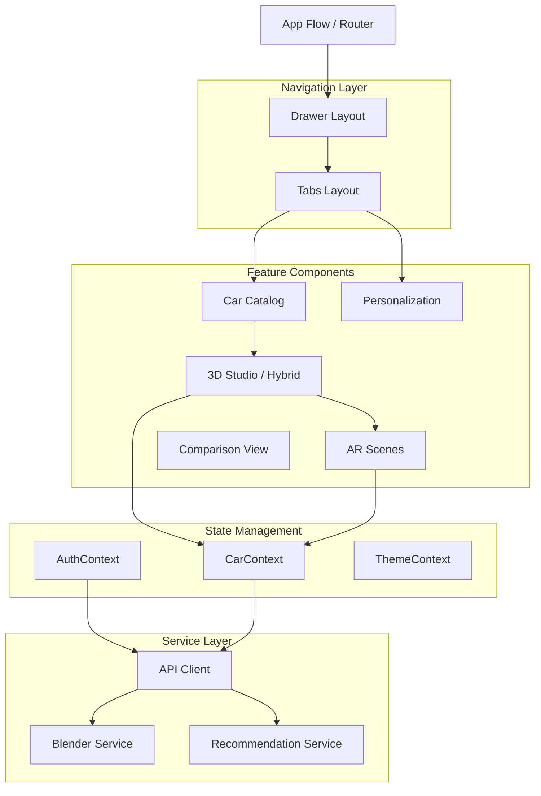
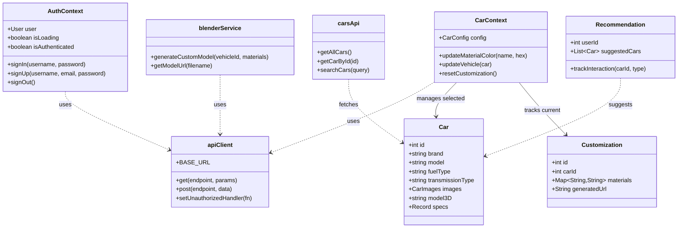
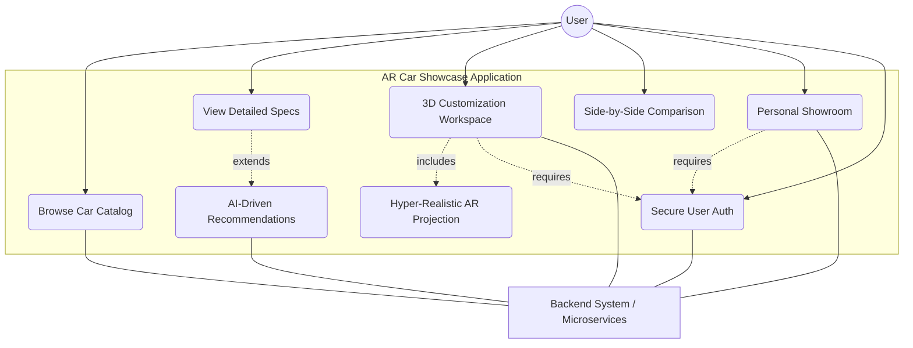
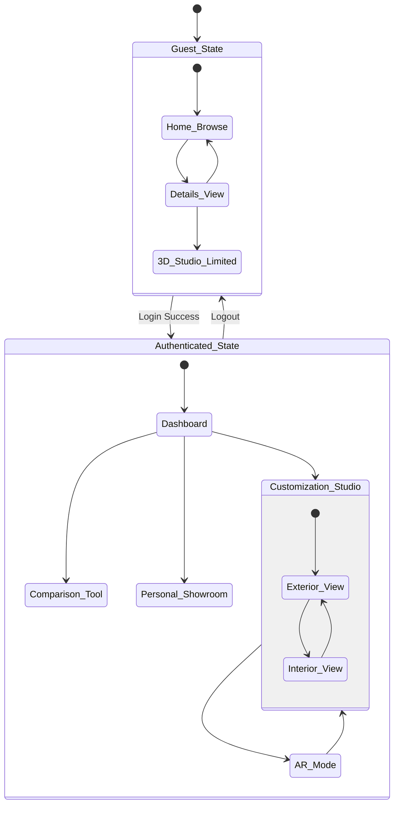
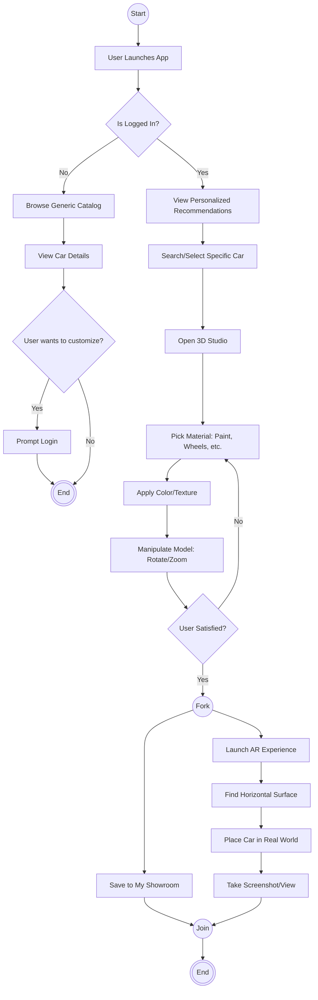
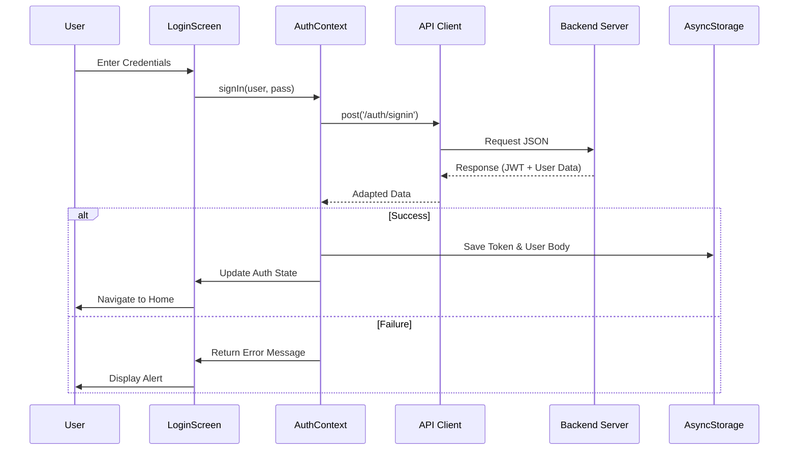
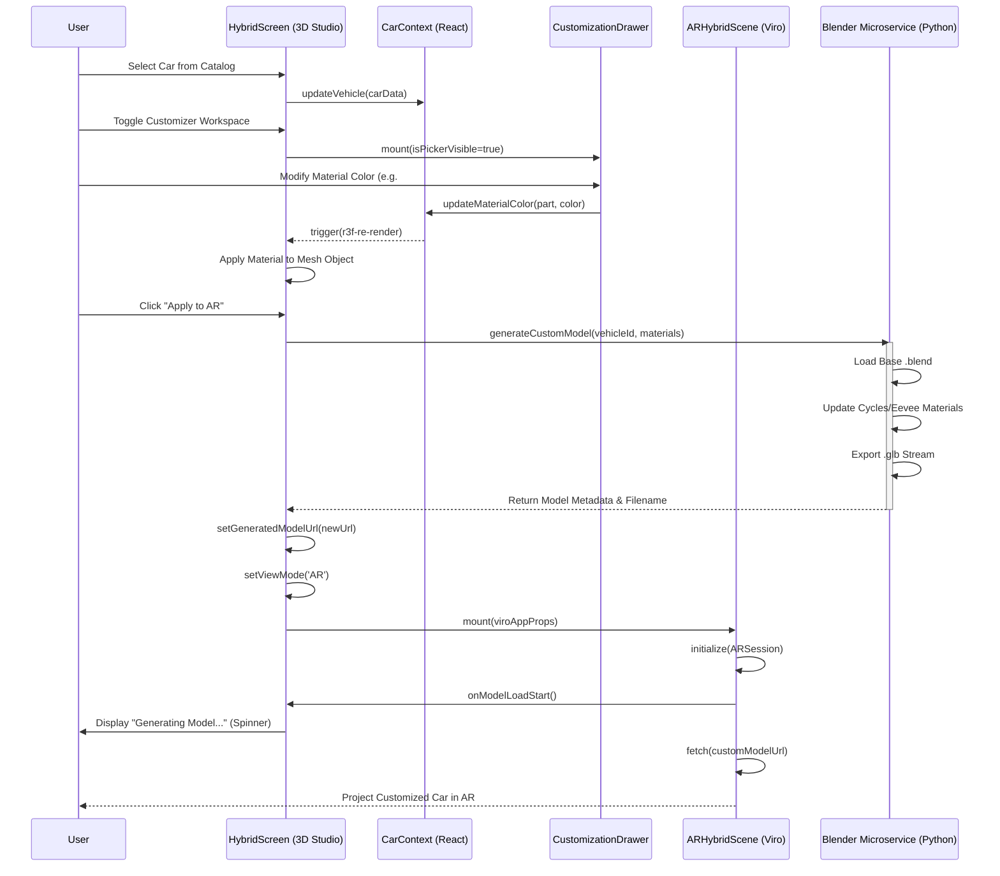
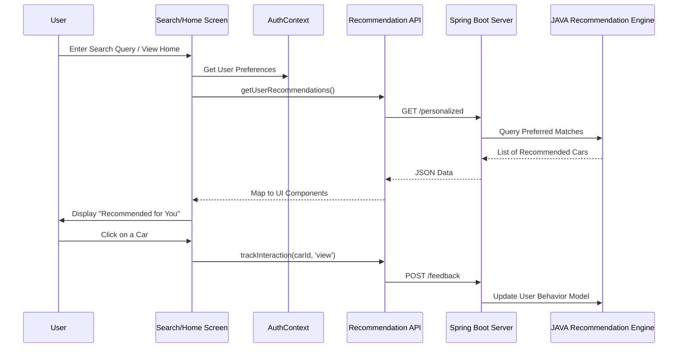

# 📊 AR Car Showcase - UML Documentation

This document serves as the detailed manifest for all the Unified Modeling Language (UML) diagrams generated for the AR Car Showcase.

---

### 🏗️ 1. Structural Architecture
These diagrams focus on the static architecture and service relationships of the AR Car Showcase ecosystem.

#### System Architecture
A high-level overview showing the React Native frontend communicating with the Spring Boot backend and Python Blender engines.

#### Component Structure
A modular breakdown showing state management, navigation layers, and service boundaries.

#### Class Diagram (Core Logic)
Defines relationships between context providers, authentication logic, and the `Car` data entities.

---

### 🚦 2. Behavioral Flows
These flowcharts map the dynamic functionality and user journey through the application.

#### Application Use Cases
An overview of all primary user actions, from browsing catalogs to 3D AR projection.

#### App State Machine
Illustrates the app navigation states between Guest viewers and Authenticated users entering the AR studio.

#### User Journey (Activity Flow)
A step-by-step logic map tracing a user's journey from app launch down to projecting a life-sized car in reality.

---

### 🔄 3. Interaction & Sequence Flows
These diagrams illustrate the chronological exchange of JSON payloads and HTTP requests between the mobile UI and backend nodes.

#### Authentication Flow
Shows the secure sign-in process, token retrieval, and local persistence.

#### 3D Customization & AR Projection Flow
Details exactly how a hex color picked by the user goes to the backend, spins up the Blender `.glb` generation, and streams down to the ViroReact AR engine.

#### Recommendation & Auto-Search Flow
Explains how user behavior feeds into the machine learning models and returns personalized car configurations in real-time.

